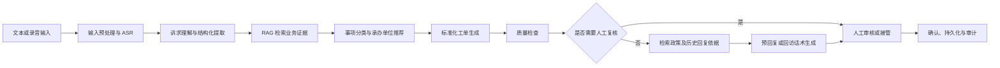

# 12345 智能工单 Agent Workshop 说明

## 一、Workshop 目标

### 1. 理解业务闭环

参与者需要理解群众诉求从进入系统到完成回复的主要环节：

1. 接收文本或录音诉求；
2. 提取事件、地点、对象、诉求、紧急程度和缺失信息；
3. 生成标准化工单；
4. 推荐事项类别和承办单位，并展示推荐依据；
5. 由工作人员审核、修改或确认；
6. 录入模拟办理结果，生成预回复或回访参考话术；
7. 保存工单状态、检索证据和审计记录。

参与者应能说明：本项目解决的是工单处理协作问题，模型输出属于辅助建议，不能直接代替工作人员作出行政判断。

### 2. 掌握核心技术思路

参与者应理解并能实际使用以下能力：

- 使用 LangChain 组织 Prompt、模型调用、结构化输出和本地回退逻辑；
- 使用 Pydantic 定义节点之间稳定、可校验的数据结构；
- 使用 LangGraph 的 State、Node 和 Edge 编排多阶段工单流程；
- 使用 Chroma 和 Embedding 检索分类目录、部门职责、历史工单及政策资料；
- 使用质量检查和人工审核处理信息缺失、紧急事件、低置信度及证据不足等情况；
- 通过 FastAPI 提供业务接口，通过 React 页面完成操作和结果展示；
- 通过 SQLite、LangGraph checkpoint、`graph_trace` 和 `audit_log` 保留状态与过程记录。

### 3. 建立可靠性与合规意识

参与者需要在实现中遵守以下原则：

- 不根据常识补造群众没有提供的事实；
- 信息缺失时明确显示缺失项，并请求补充或转人工处理；
- 分类和部门推荐尽量引用当前知识库中的依据；
- 证据不足、职责交叉或结果冲突时显示候选和风险，不强行给出唯一结论；
- 回复草稿以已录入的办理结果为主要事实来源；
- 真实密钥只保存在后端 `.env`，演示数据应经过脱敏处理；
- 模型或外部服务不可用时，系统仍可通过本地引擎完成基础演示。

### 4. 形成可继续参赛的成果

Workshop 结束时，参与者应获得一套可运行的 MVP、明确的技术架构和可复现的演示流程，并能据此继续完善创意说明书、技术架构图、演示视频或体验链接。

---

## 二、技术路线

### 1. 总体流程

当前工程的 LangGraph 主节点包括：`prepare_input`、`understand`、`retrieve_context`、`classify`、`workorder`、`quality_check`、`retrieve_reply_context`、`reply`、`human_review` 和 `persist`。各节点共享同一份案件状态，并以 `case_id` 作为流程线程标识。

### 2. 分层架构

| 层次 | 当前技术 | 主要职责 |
| --- | --- | --- |
| 交互层 | React、TypeScript、Vite | 输入诉求、展示六阶段处理结果、编辑和确认工单、管理部门规则与政策文件 |
| API 层 | FastAPI | 提供案件、工单、分类、回复、确认、历史检索、规则及政策文件接口 |
| 智能能力层 | LangChain、兼容 OpenAI 接口的大模型、本地规则引擎 | 诉求理解、结构化生成、分类、工单生成、回复拟稿和失败回退 |
| 流程编排层 | LangGraph | 管理共享状态、条件分支、质量检查、人工审核、checkpoint 和流程轨迹 |
| 知识检索层 | LangChain Retriever、Chroma、Sentence Transformers | 对分类目录、部门职责、历史案例和政策资料执行向量检索与元数据过滤 |
| 数据与状态层 | JSON、SQLite、Chroma 持久化目录 | 保存业务数据、案件状态、知识索引、审计日志和流程轨迹 |
| 输入扩展层 | 科大讯飞 ASR、faster-whisper、样例匹配与模拟转写 | 将录音转换为文本；文本输入作为稳定的基础路径 |

### 3. RAG 知识组织

项目当前使用四类 Chroma collection：

- `category_catalog`：事项分类目录；
- `department_rules`：部门职责和转派规则；
- `historical_cases`：脱敏历史工单；
- `policy_docs`：政策文件和办理依据。

分类阶段检索分类目录、部门职责和少量历史案例；工单生成阶段参考相似历史工单；回复阶段检索历史案例和政策资料。检索结果需要保留来源和元数据，供生成节点与人工审核使用。

### 4. 可靠性路线

系统采用“可用大模型时优先调用，失败时回退本地引擎”的策略。质量检查重点识别：

- `missing_information`：关键信息缺失；
- `urgent`：燃气泄漏等紧急安全事件；
- `classification_needs_manual`：分类置信度低或需要人工判断；
- `no_rag_evidence`：没有检索到业务证据。

其中信息缺失、紧急事件和低置信度分类应进入人工复核。所有阶段结果都应能通过 `source`、`retrieved_contexts`、`rag_status`、`quality_flags`、`graph_trace` 和 `audit_log` 进行追踪。

---

## 三、实验内容

实验按“先跑通、再观察、后改进”的顺序进行。基础实验使用项目内置脱敏样例，即使没有模型 Key 或录音转写服务也可以完成。

### 实验 1：环境与基础服务验证

**目标：** 确认后端、前端、样例数据和本地回退能力可用。

**操作：**

1. 按项目 `README.md` 配置后端环境并启动服务；
2. 访问首页、`/health`、`/docs` 和 `/api/meta`；
3. 检查首页能否读取工单、部门规则和样例列表；
4. 未配置真实模型 Key 时，确认 `engine_mode` 显示为 `local-engine`。

**验收：** 页面可打开，健康检查成功，样例数据可读取，外部模型不可用时基础流程仍能运行。

### 实验 2：文本诉求端到端闭环

**目标：** 跑通从群众诉求到人工确认的完整链路。

**建议样例：** `mock-001`，理发店未公示价格及营业执照问题。

**操作：**

1. 创建案件并检查结构化诉求要素；
2. 查看推荐的事项类别、承办单位、理由及证据；
3. 生成并人工修改标准化工单；
4. 生成预回复或回访话术；
5. 填写操作人和审核备注，完成确认；
6. 重新打开该 `case_id`，检查各阶段结果是否仍然存在。

**验收：** 原始诉求、结构化要素、工单、分类推荐和回复内容语义一致；关键结果可编辑、可确认、可追溯。

### 实验 3：异常输入与人工接管

**目标：** 验证系统不会把异常情况包装成确定性答案。

**建议样例：**

| 样例 | 场景 | 观察重点 |
| --- | --- | --- |
| `mock-002` | 垃圾多日未清理，但地点不完整 | 是否显示缺失信息并要求补充或复核 |
| `mock-005` | 重复反映欠薪问题 | 是否识别重复诉求，并保留历史检索结果 |
| `mock-006` | 楼道内疑似燃气泄漏 | 是否标记紧急，并进入人工审核路径 |
| 自定义跨部门诉求 | 同时涉及多个职责 | 是否展示候选单位、依据和冲突，而非强行单选 |

**验收：** `quality_flags`、`human_review_required` 和 `next_action` 与场景相符；人工审核后能够继续处理并留下审计记录。

### 实验 4：RAG 检索与证据追踪

**目标：** 理解知识库如何约束分类、转派和回复生成。

**操作：**

1. 查看四个 collection 的记录数量；
2. 用“路灯不亮找谁”等自然语言检索部门职责；
3. 对同一诉求分别查看分类、工单和回复阶段检索到的证据；
4. 上传一份允许使用的政策文件，补充文件名称、发布单位和所属分类并完成入库；
5. 再次执行相关诉求，观察 `policy_docs` 是否进入回复证据；
6. 删除测试政策文件，确认文件记录和对应向量同步清理。

**验收：** 检索结果包含来源和分类等元数据；生成结果能够对应到证据；无证据时系统提示风险或转人工处理。

### 实验 5：LangGraph 状态、分支与恢复

**目标：** 观察复杂业务流程如何通过状态图执行和留痕。

**操作：**

1. 分别运行普通、缺失信息和紧急诉求；
2. 对比三条案件的 `graph_trace`、`quality_flags` 和 `next_action`；
3. 检查同一 `case_id` 的阶段结果是否能够继续使用；
4. 在人工审核时修改结果并填写备注；
5. 检查 `audit_log` 是否记录理解、检索、分类、工单、质检、审核和持久化等动作。

**验收：** 正常案件和异常案件进入正确分支；流程状态可恢复；人工修改及操作记录可以追溯。

### 实验 6：模型、ASR 与回退能力对比（进阶）

**目标：** 比较真实服务与本地回退模式的输出差异和稳定性。

**操作：**

1. 在获得授权的前提下，在后端 `.env` 配置模型或 ASR 服务；
2. 使用同一文本分别在大模型模式和本地引擎模式运行；
3. 使用项目内授权录音测试录音输入；
4. 比较结构完整性、事实一致性、分类理由、响应时间和失败回退结果；
5. 检查 `source` 与 `transcript_source` 是否准确标明实际来源。

**验收：** 服务切换不会破坏业务接口；外部调用失败时可以回退；页面和日志能够区分真实调用与本地结果。

### 实验 7：自动测试与演示收口

**目标：** 用固定测试和演示脚本证明 MVP 可复现。

**操作：**

1. 运行后端测试，重点关注 API 全链路、边界案例、LangGraph、RAG、政策上传和规则更新；
2. 修复会影响演示的失败项；
3. 选取一条普通诉求和一条异常诉求，整理 3～5 分钟演示脚本；
4. 记录输入、关键节点、检索证据、人工审核和最终输出。

**验收：** 核心测试通过；演示可以从空白输入稳定运行到人工确认；讲解者能说明每个节点的输入、输出、依据和人工边界。

---

## 四、用户最终完成目标

### 1. 最低完成目标

Workshop 结束时，每位参与者或每个小组至少应完成以下内容：

- 能在本机启动 `12345agent-3`，打开首页和工作流页面；
- 输入一条文本诉求，得到结构化事实、缺失字段和紧急程度；
- 生成可编辑的标准化工单；
- 得到事项分类和承办单位候选，并看到推荐理由或证据；
- 在人工审核环节修改或确认结果；
- 生成预回复或回访参考话术；
- 使用至少 3 条不同类型样例完成回放，其中包含正常、信息缺失或紧急场景；
- 能说明模型输出的来源、系统限制和必须人工审核的位置。

### 2. 推荐完成目标

在最低目标基础上，参与者应争取完成：

- 跑通文本或录音输入的完整闭环；
- 使用 RAG 检索至少一种自定义政策或部门职责资料；
- 展示一次低置信度、证据不足或职责冲突的人工接管；
- 通过 `graph_trace` 和 `audit_log` 展示流程及审核记录；
- 完成主要自动测试，并保留测试结果；
- 形成可复现的 README、架构图和 3～5 分钟演示脚本或录屏。

### 3. 可选增强目标

时间允许时，可选择一至两个方向深入：

- 多轮追问与缺失信息补全；
- 职责冲突解释与主责、协办人工裁决；
- 政策版本和有效期校验；
- 混合检索、重排及 RAG 评测集；
- 工单事实一致性检查和回复引用校验；
- 热点分析、重复诉求识别或更完整的数据看板；
- 更可靠的 ASR、重试、超时处理和流程恢复。

### 4. 最终验收标准

最终作品应同时满足以下五点：

1. **能运行：** 基础环境下可以稳定完成至少一条端到端流程；
2. **能解释：** 分类、转派和回复建议能够展示依据或风险提示；
3. **能审核：** 关键结果可被工作人员查看、修改、确认或驳回；
4. **能处理失败：** 信息缺失、紧急事件、证据不足和外部服务异常有明确去向；
5. **能追溯：** 原始输入、节点结果、证据、人工操作和最终输出能够按 `case_id` 查询。

若用于后续参赛提交，建议在此基础上整理“解决方案说明 + 技术架构图 + 可选原型或演示视频”，并明确数据来源、隐私处理、系统限制和人工责任边界。

